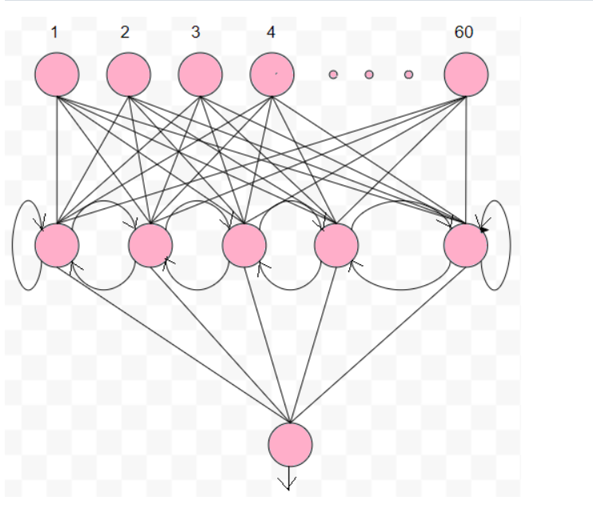
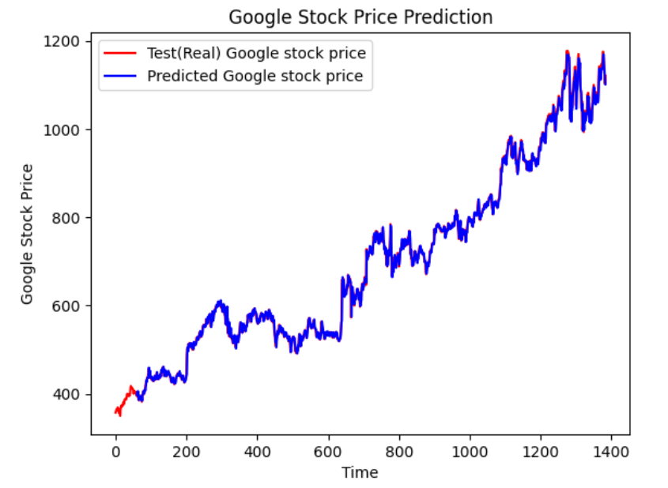

### EX NO : 05
### DATE  : 
# Stock Price Prediction

## AIM :

To develop a Recurrent Neural Network model for stock price prediction.

## Problem Statement and Dataset:
Develop a Recurrent Neural Network model for stock price prediction using the stock prediction dataset.

Here we have taken the price of google stock dataset


## Neural Network Model:



## DESIGN STEPS :

### STEP 1:
Read the csv file and create the Data frame using pandas.


### STEP 2:
Select the " Open " column for prediction. Or select any column of your interest and scale the values using MinMaxScaler.
### STEP 3:

Create two lists for X_train and y_train. And append the collection of 60 readings in X_train, for which the 61st reading will be the first output in y_train.

### STEP 4:
Create a model with the desired number of neurons and one output neuron.


### STEP 5:

Follow the same steps to create the Test data. But make sure you combine the training data with the test data.

### STEP 6:
Make Predictions and plot the graph with the Actual and Predicted values.


## PROGRAM :
Developed By: **Virgil Jovita.A**
<br/>
Register Number: **212221240062**
```python
import numpy as np
import matplotlib.pyplot as plt
import pandas as pd
from sklearn.preprocessing import MinMaxScaler
from keras import layers
from keras.models import Sequential
from tensorflow.keras import models
from tensorflow.keras import layers

dataset_train = pd.read_csv('trainset.csv')
dataset_train.columns
dataset_train.head()
train_set = dataset_train.iloc[:,1:2].values
type(train_set)
train_set.shape

sc = MinMaxScaler(feature_range=(0,1))
training_set_scaled = sc.fit_transform(train_set)
training_set_scaled.shape

X_train_array = []
y_train_array = []
for i in range(60, 1259):
    X_train_array.append(training_set_scaled[i-60:i,0])
    y_train_array.append(training_set_scaled[i,0])

X_train, y_train = np.array(X_train_array), np.array(y_train_array)
X_train1 = X_train.reshape((X_train.shape[0], X_train.shape[1],1))
X_train.shape

length = 60
n_features = 1

model = models.Sequential()
model.add(layers.SimpleRNN(10,input_shape=(length,n_features)))
model.add(layers.Dense(1))

model.compile(optimizer='rmsprop', loss='mse',metrics ='accuracy')

model.summary()

model.fit(X_train1,y_train,epochs=100, batch_size=64)

dataset_test = pd.read_csv('testset.csv')
test_set = dataset_test.iloc[:,1:2].values
test_set.shape

dataset_total = pd.concat((dataset_train['Open'],dataset_test['Open']),axis=0)

inputs = dataset_total.values
inputs = inputs.reshape(-1,1)
inputs_scaled=sc.transform(inputs)

X_test = []
for i in range(60,1384):
    X_test.append(inputs_scaled[i-60:i,0])
    X_test = np.array(X_test)
    X_test = np.reshape(X_test,(X_test.shape[0], X_test.shape[1],1))
X_test.shape

predicted_stock_price_scaled = model.predict(X_test)
predicted_stock_price = sc.inverse_transform(predicted_stock_price_scaled)
plt.plot(np.arange(0,1384),inputs, color='black', label = 'Test(Real) Google stock price')
plt.plot(np.arange(60,1384),predicted_stock_price, color='blue', label = 'Predicted Google stock price')
plt.title('Google Stock Price Prediction')
plt.xlabel('Time')
plt.ylabel('Google Stock Price')
plt.legend()
plt.show()

```

## OUTPUT :

### True Stock Price, Predicted Stock Price vs time


### Mean Square Error


## RESULT :
Thus, we have successfully created a Simple RNN model for Stock Price Prediction.
